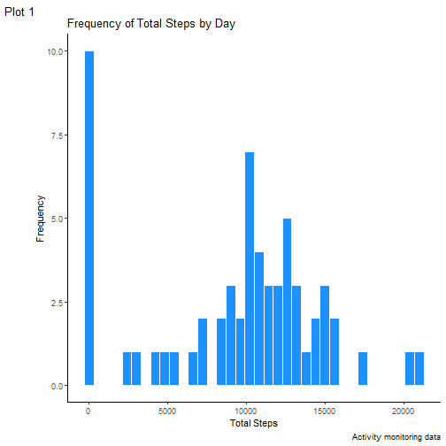
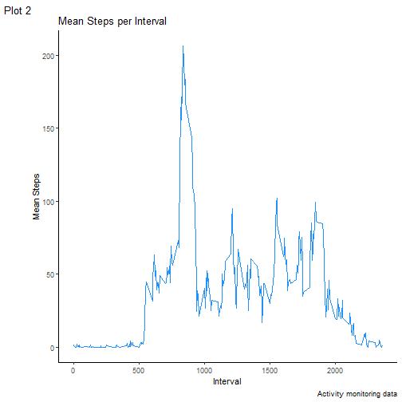
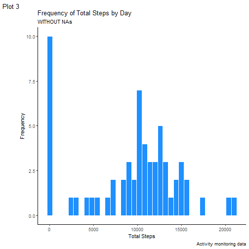
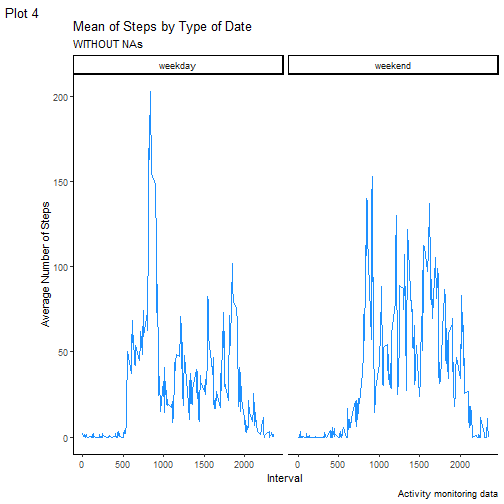

## Introduction

It is now possible to collect a large amount of data about personal movement using activity monitoring devices such as a Fitbit, Nike Fuelband, or Jawbone Up. These type of devices are part of the “quantified self” movement – a group of enthusiasts who take measurements about themselves regularly to improve their health, to find patterns in their behavior, or because they are tech geeks. But these data remain under-utilized both because the raw data are hard to obtain and there is a lack of statistical methods and software for processing and interpreting the data.

This assignment makes use of data from a personal activity monitoring device. This device collects data at 5 minute intervals through out the day. The data consists of two months of data from an anonymous individual collected during the months of October and November, 2012 and include the number of steps taken in 5 minute intervals each day.

The data for this assignment can be downloaded from the course web site:

**Dataset**: [Activity monitoring data](https://d396qusza40orc.cloudfront.net/repdata%2Fdata%2Factivity.zip) [52K]  
  
The variables included in this dataset are:  
**steps**: Number of steps taking in a 5-minute interval (missing values are coded as \color{red}{\verb|NA|}NA)  
**date**: The date on which the measurement was taken in YYYY-MM-DD format  
**interval**: Identifier for the 5-minute interval in which measurement was taken  
  
The dataset is stored in a comma-separated-value (CSV) file and there are a total of 17,568 observations in this dataset  
  
## Loading and preprocessing the data  
  
##### Packages

```r
suppressPackageStartupMessages(library(data.table))
suppressPackageStartupMessages(library(dplyr))
suppressPackageStartupMessages(library(ggplot2))
```
  
##### Create folder to store the data downloaded  

```r
#Create a sub folder (IF NOT EXISTS) to store the data
sub_dir <- "project_data"
output_dir <- file.path(getwd(), sub_dir)

if (!dir.exists(output_dir)){
    dir.create(output_dir)
}
```
  
#####  Donwload and unzip the file  

```r
zip_file <- file.path( output_dir, "raw_data.zip")
url_target <- "https://d396qusza40orc.cloudfront.net/repdata%2Fdata%2Factivity.zip"
download.file(url_target, zip_file)
unzip(zipfile=zip_file, exdir = output_dir)
```
    
##### Read the file into a data table  

```r
activity <- fread(file.path( output_dir, "activity.csv"))
```
    
### Process/transform the data (if necessary) into a format suitable for your analysis  
No data transformation was necessary

## What is mean total number of steps taken per day?  
*For this part of the assignment, you can ignore the missing values in the dataset.*  
  
### Calculate the total number of steps taken per day

```r
steps_per_day <- activity %>%  group_by(date)  %>% summarise(Total_Steps = sum(steps, na.rm=TRUE))  
```

```
## `summarise()` ungrouping output (override with `.groups` argument)
```

### Make a histogram of the total number of steps taken each day

```r
ggplot(data=steps_per_day, aes(Total_Steps)) + 
      geom_histogram( binwidth = 600, 
                      fill = "dodgerblue",
                      col="white") +
      labs(
            title = "Frequency of Total Steps by Day",
            caption = "Activity monitoring data",
            tag = "Plot 1",
            x = "Total Steps",
            y = "Frequency"
            ) +
      theme_classic()
```


  
### Calculate and report the mean and median total number of steps taken per day

```r
steps_per_day_mean <- mean(steps_per_day$Total_Steps)
steps_per_day_median <- median(steps_per_day$Total_Steps)
```
* **Mean**: 9354.2295082
* **Median**:  10395
  
## What is the average daily activity pattern?  

### Make a time series plot (i.e. \color{red}{\verb|type = "l"|}type = "l") of the 5-minute interval (x-axis) and the average number of steps taken, averaged across all days (y-axis)  

```r
steps_per_interval <- activity %>%  group_by(interval)  %>% summarise(Mean_Steps = mean(steps, na.rm=TRUE)) 
```

```
## `summarise()` ungrouping output (override with `.groups` argument)
```

```r
ggplot(data=steps_per_interval, aes(x=interval, y=Mean_Steps)) + 
      geom_line( col="dodgerblue") +
      labs(
            title = "Mean Steps per Interval",
            caption = "Activity monitoring data",
            tag = "Plot 2",
            x = "Interval",
            y = "Mean Steps"
            ) +
      theme_classic()
```



### Which 5-minute interval, on average across all the days in the dataset, contains the maximum number of steps?

```r
Max_Steps <- which.max(steps_per_interval$Mean_Steps)
```

* **Most Steps at**: 835

## Imputing missing values  
Note that there are a number of days/intervals where there are missing values (coded as NA). The presence of missing days may introduce bias into some calculations or summaries of the data.

### Calculate and report the total number of missing values in the dataset (i.e. the total number of rows with NA) \color{red}{\verb|NA|}NAs)  

```r
Total_Missing_Values <- nrow(activity[is.na(steps)])
```

* **Number of missing values**: 2304  


## Devise a strategy for filling in all of the missing values in the dataset. 
The strategy does not need to be sophisticated. For example, you could use the mean/median for that day, or the mean for that 5-minute interval, etc. 
*The NA values will be replaced by the average in the correspondent day*  


## New dataset with misssing data filled in  
Create a new dataset that is equal to the original dataset but with the missing data filled in.  

```r
# Save the dataset in another variable
activity_non_na <- activity

# Calculate the mean of the day
activity_non_na[, mean_of_day := mean(steps, na.rm = TRUE), by = date]

# Replace the NAN means for zero
activity_non_na[is.na(mean_of_day), mean_of_day:= 0]

# Set the NA with the mean of the day
activity_non_na[is.na(steps), steps:= mean_of_day]
```
  
## Histogram of the total number of steps
Make a histogram of the total number of steps taken each day and Calculate and report the mean and median total number of steps taken per day. Do these values differ from the estimates from the first part of the assignment? What is the impact of imputing missing data on the estimates of the total daily number of steps?  
  
#### Histogram of the total number of steps

```r
steps_per_day_non_na <- activity_non_na  %>%  group_by(date)  %>% summarise(Total_Steps = sum(steps, na.rm=TRUE)) 
```

```
## `summarise()` ungrouping output (override with `.groups` argument)
```

```r
ggplot(data=steps_per_day_non_na, aes(Total_Steps)) + 
      geom_histogram( binwidth = 600, 
                      fill = "dodgerblue",
                      col="white") +
      labs(
            title = "Frequency of Total Steps by Day",
            subtitle = "WITHOUT NAs",
            caption = "Activity monitoring data",
            tag = "Plot 3",
            x = "Total Steps",
            y = "Frequency"
            ) +
      theme_classic()
```


  
#### Mean and median total number of steps taken per day

```r
steps_per_day_mean_non_na <- mean(steps_per_day_non_na$Total_Steps)
steps_per_day_median_non_na <- median(steps_per_day_non_na$Total_Steps)
```
* **Mean (Non-NA)**: 9354.2295082
* **Median (Non-NA)**:  10395
  
## Are there differences in activity patterns between weekdays and weekends?
For this part the weekdays() function may be of some help here. Use the dataset with the filled-in missing values for this part.  
  
#### Create a new factor variable  
Create a new factor variable in the dataset with two levels – “weekday” and “weekend” indicating whether a given date is a weekday or weekend day.in the dataset with two levels – “weekday” and “weekend” indicating whether a given date is a weekday or weekend day.  
  

```r
activity_non_na[,date_type := ifelse(as.POSIXlt(date)$wday %in% c(0,6), 'weekend', 'weekday')]
```
  
#### Make a panel plot  
Make a panel plot containing a time series plot (type = "l") of the 5-minute interval (x-axis) and the average number of steps taken, averaged across all weekday days or weekend days (y-axis). See the README file in the GitHub repository to see an example of what this plot should look like using simulated data.
    

```r
steps_per_interval_date_type_mean <- activity_non_na  %>%  
                                     group_by(interval, date_type)  %>% 
                                     summarise(Mean_Steps = mean(steps, na.rm=TRUE)) 
```

```
## `summarise()` regrouping output by 'interval' (override with `.groups` argument)
```

```r
ggplot(data=steps_per_interval_date_type_mean, aes(interval, Mean_Steps )) + 
      geom_line( col="dodgerblue") +
      facet_grid(.~date_type) +
      labs(
            title = "Mean of Steps by Type of Date",
            subtitle = "WITHOUT NAs",
            caption = "Activity monitoring data",
            tag = "Plot 4",
            x = "Interval",
            y = "Average Number of Steps"
            ) +
      theme_classic()
```


